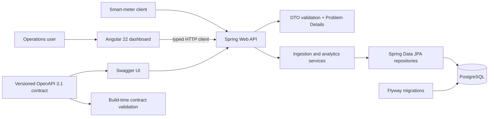

# Smart Grid Energy Platform

A full-stack reference application for ingesting smart-meter readings and turning them into an operational grid-control dashboard. The repository combines a Java 21 / Spring Boot API with a strict Angular 22 frontend, PostgreSQL persistence, schema migrations, a contract-first OpenAPI 3.1 definition, containerized local infrastructure and CI.

> This is a portfolio and learning project built with synthetic demo data. It is not connected to a utility, billing process or real metering infrastructure.

## What it demonstrates

- Validated ingestion through `POST /api/v1/readings/ingest`
- Grid-load analytics through `GET /api/v1/analytics/grid-load?timespan=24h`
- Grid-area comparison through `GET /api/v1/analytics/grid-areas?timespan=24h`
- Configurable anomaly detection through `GET /api/v1/analytics/anomalies?thresholdKwh=4.5`
- Meter-fleet inventory and lifecycle through `GET /api/v1/meters` and `PATCH /api/v1/meters/{meterId}/status`
- Supported dashboard periods: `1h`, `6h`, `24h` and `7d`
- JPA domain model for `SmartMeter`, `MeterReading` and `TariffPlan`
- Flyway-owned PostgreSQL schema with uniqueness, foreign-key and range constraints
- Consistent RFC 9457 problem responses for validation and domain failures
- A versioned OpenAPI 3.1 contract with stable operation IDs, examples and RFC 9457 responses
- Build-time OpenAPI parser validation and Swagger UI configured against the canonical YAML contract
- Responsive Angular operations dashboard with KPIs, area health, anomaly monitoring, fleet controls, an accessible SVG load profile and telemetry form
- Explicit loading, error and empty states, plus client- and server-side validation
- Repeatable Docker Compose environment and separate backend/frontend CI jobs

## Architecture



The backend keeps transport models, controllers, application services, persistence repositories and JPA entities in separate packages. Analytics remain database-agnostic at the service boundary: the repository returns readings for a bounded interval and the service produces UTC buckets and aggregate KPIs.

## Stack

| Area | Technology |
| --- | --- |
| Backend | Java 21, Spring Boot 3.5, Spring Web, Validation, Spring Data JPA |
| Data | PostgreSQL 17, Flyway; H2 in PostgreSQL mode for fast integration tests |
| API | Contract-first OpenAPI 3.1, Swagger UI, RFC 9457 Problem Details, Actuator |
| Frontend | Angular 22, TypeScript 6 strict mode, signals, reactive forms, RxJS |
| Quality | JUnit 5, Mockito, MockMvc, Vitest, Angular ESLint |
| Delivery | Docker Compose, multi-stage images, Nginx, GitHub Actions, Dependabot |

## Run the complete platform

Requirements: Docker Desktop, OrbStack or another Docker Compose-compatible runtime.

```bash
docker compose up --build
```

Then open:

- Dashboard: <http://localhost:4200>
- Swagger UI: <http://localhost:8080/swagger-ui.html>
- Canonical OpenAPI YAML: <http://localhost:8080/openapi/smart-grid-api.yaml>
- Generated runtime OpenAPI JSON: <http://localhost:8080/v3/api-docs>
- Health: <http://localhost:8080/actuator/health>

The Compose profile starts PostgreSQL, the API and Nginx-hosted Angular UI. The backend's `demo` profile inserts synthetic readings only when the readings table is empty, so the dashboard is useful on first launch. Stop the stack with `docker compose down`; add `-v` only when you intentionally want to remove the local database volume.

## OpenAPI contract

The canonical API contract is [`src/main/resources/static/openapi/smart-grid-api.yaml`](src/main/resources/static/openapi/smart-grid-api.yaml). It is checked into the repository, served by the application and used directly by Swagger UI. This keeps operation IDs, request constraints, examples and error payloads reviewable without starting the backend.

`OpenApiContractTest` parses and resolves the complete specification during `mvn verify`, rejects parser messages and checks that every public resource is present. Integration tests additionally verify that the application serves the same YAML document. Spring's generated `/v3/api-docs` remains available as an implementation view; the versioned YAML is the stable client contract.

## Local development

Backend prerequisites: JDK 21+ and Maven 3.6.3+. Frontend prerequisites: Node.js 24 and npm.

```bash
# terminal 1: database
docker compose up -d postgres

# terminal 2: backend
mvn spring-boot:run

# terminal 3: frontend (proxies /api to localhost:8080)
cd frontend
npm ci
npm start
```

Environment variables:

| Variable | Default |
| --- | --- |
| `DATABASE_URL` | `jdbc:postgresql://localhost:5432/smartgrid` |
| `DATABASE_USERNAME` | `smartgrid` |
| `DATABASE_PASSWORD` | `smartgrid` |
| `CORS_ALLOWED_ORIGINS` | `http://localhost:4200,http://127.0.0.1:4200` |
| `SPRING_PROFILES_ACTIVE` | unset; use `demo` only for synthetic seed data |

## API examples

Ingest a reading:

```bash
curl --fail-with-body http://localhost:8080/api/v1/readings/ingest \
  --header 'Content-Type: application/json' \
  --data '{
    "meterId": "AT-VIE-1042",
    "gridArea": "Vienna-Center",
    "consumptionKwh": 3.725,
    "recordedAt": "2026-08-21T08:00:00Z"
  }'
```

Read the last 24 hours of aggregate load:

```bash
curl --fail-with-body 'http://localhost:8080/api/v1/analytics/grid-load?timespan=24h'
```

Inspect the fleet and compare operational areas:

```bash
curl --fail-with-body 'http://localhost:8080/api/v1/meters?status=ACTIVE'
curl --fail-with-body 'http://localhost:8080/api/v1/analytics/grid-areas?timespan=24h'
curl --fail-with-body 'http://localhost:8080/api/v1/analytics/anomalies?timespan=24h&thresholdKwh=4.5'
```

The ingestion endpoint returns `201 Created`, rejects malformed input with `400 Bad Request`, and returns `409 Conflict` when a meter already has a reading for the same timestamp.

## Verification

```bash
# backend unit, repository, MVC and full-flow integration tests
mvn verify

# frontend static analysis, component/service tests and optimized bundle
cd frontend
npm ci
npm run lint
npm test
npm run build

# dependency audit
npm audit --audit-level=high
```

Backend tests use H2 in PostgreSQL compatibility mode and execute the real Flyway migration. This keeps the suite fast while checking that the JPA mappings and versioned schema agree. PostgreSQL remains the production runtime; Compose is the intended end-to-end database check.

## Design decisions and limits

- A reading is unique per meter and timestamp, which makes retries explicit rather than silently duplicating consumption.
- Unknown meter IDs are registered on first valid ingestion for demo convenience; their operational status can then be managed through the fleet API. A production utility would provision them through an authenticated master-data workflow.
- JSON requests reject unknown fields, and validation rules intentionally mirror the published OpenAPI contract.
- Area health uses a transparent peak-to-average classification; production thresholds would be calibrated per transformer and network segment.
- Dashboard aggregation is intentionally transparent and easy to test. At high event volumes it should move to database-side time buckets, a time-series store or a pre-aggregation pipeline.
- Authentication, authorization, message-broker ingestion, cryptographic device identity and billing-grade audit trails are deliberately outside this reference scope.
- Tariff data is modeled and migrated to show the next domain boundary; price calculation is not exposed until its business rules are defined.

## Repository layout

```text
.
├── src/main/java/at/wien/smartgrid  # Spring Boot API
├── src/main/resources/db/migration  # Flyway migrations
├── src/main/resources/static/openapi # canonical OpenAPI 3.1 contract
├── src/test                         # backend tests and H2 profile
├── frontend                         # Angular dashboard and tests
├── .github/workflows/ci.yml         # Java and Angular CI
├── Dockerfile                       # backend image
└── docker-compose.yml               # PostgreSQL + backend + frontend
```
