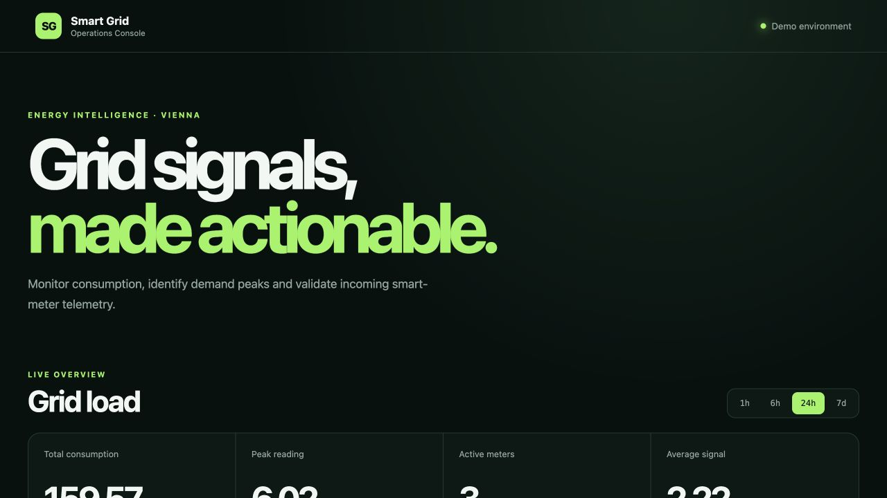
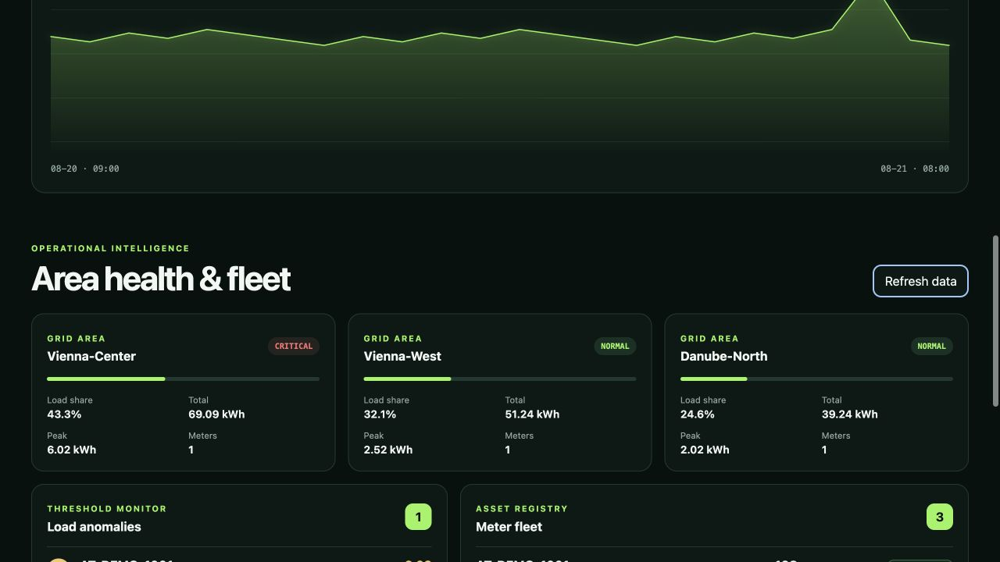
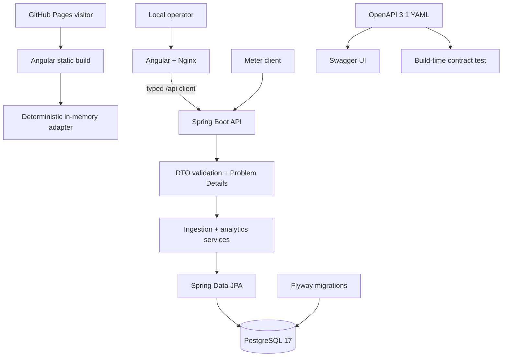

<div align="center">

# Smart Grid Energy Platform

**A full-stack operations console for smart-meter ingestion, grid analytics and fleet monitoring.**

[](https://github.com/General-Iroh32/smart-grid-energy-api/actions)
[](https://spring.io/projects/spring-boot)
[](https://angular.dev/)
[](src/main/resources/static/openapi/smart-grid-api.yaml)

[**Open the interactive dashboard →**](https://general-iroh32.github.io/smart-grid-energy-api/)

</div>

The hosted dashboard is the fastest way to explore the product without infrastructure. Run Docker Compose when you want the complete Spring Boot, PostgreSQL, Flyway and Swagger UI path.



## The project

Smart Grid Energy Platform is a production-shaped reference application for
turning smart-meter readings into an operational view of a power grid. It joins
a Java 21 / Spring Boot API, PostgreSQL and Flyway with a strict Angular frontend,
a versioned OpenAPI 3.1 contract, containerized delivery and separate CI paths.

The hosted demo uses deterministic synthetic data and runs entirely in the
browser. It keeps the dashboard interactive—period selection, telemetry ingest
and meter lifecycle changes all work—but resets on refresh. The full Docker
Compose environment exercises the real Java API and PostgreSQL persistence path.

> This is a learning and reference system. It is not connected to a utility,
> billing workflow or real metering infrastructure.

## What you can explore

- Switch analytics between `1h`, `6h`, `24h` and `7d` windows.
- Inspect total consumption, peaks, averages and active-meter counts.
- Compare load share and operating state across grid areas.
- Surface readings above a configurable anomaly threshold.
- Register new meter readings through a validated reactive form.
- Activate and deactivate meters from the fleet view.
- Exercise RFC 9457 validation, conflict and domain error responses.
- Explore all API operations through Swagger UI and the canonical YAML contract.



## Two deliberately different demo paths



The static adapter is explicit and replaceable; it does not pretend browser
state is PostgreSQL. Both paths use the same typed frontend service boundary,
which keeps the hosted demo useful without weakening the full-stack architecture.

## Technology at a glance

| Layer | Technology |
| --- | --- |
| Backend | Java 21, Spring Boot 3.5, Spring Web, Bean Validation |
| Persistence | Spring Data JPA, PostgreSQL 17, Flyway |
| API contract | OpenAPI 3.1, Swagger UI, RFC 9457 Problem Details |
| Frontend | Angular 22, TypeScript strict mode, signals, RxJS, reactive forms |
| Testing | JUnit 5, Mockito, MockMvc, H2 PostgreSQL mode, Vitest |
| Delivery | Multi-stage Docker images, Nginx, Compose, GitHub Actions, GHCR |

## Run the full platform

Docker Desktop, OrbStack or another Docker Compose-compatible runtime is enough:

```bash
git clone https://github.com/General-Iroh32/smart-grid-energy-api.git
cd smart-grid-energy-api
docker compose up --build
```

| Service | URL |
| --- | --- |
| Operations dashboard | <http://localhost:4200> |
| Swagger UI | <http://localhost:8080/swagger-ui.html> |
| Canonical OpenAPI YAML | <http://localhost:8080/openapi/smart-grid-api.yaml> |
| Generated OpenAPI JSON | <http://localhost:8080/v3/api-docs> |
| Health endpoint | <http://localhost:8080/actuator/health> |

The `demo` profile seeds synthetic readings only when the readings table is
empty. Stop the stack with `docker compose down`. Add `-v` only when you
intentionally want to remove the local PostgreSQL volume.

## API surface

| Method | Resource | Purpose |
| --- | --- | --- |
| `POST` | `/api/v1/readings/ingest` | Validate and store meter telemetry |
| `GET` | `/api/v1/analytics/grid-load` | Aggregate load for a supported time window |
| `GET` | `/api/v1/analytics/grid-areas` | Compare grid-area load and health |
| `GET` | `/api/v1/analytics/anomalies` | Find readings over a configurable threshold |
| `GET` | `/api/v1/meters` | Search the meter fleet by status |
| `PATCH` | `/api/v1/meters/{meterId}/status` | Change operational status |

Ingest a reading:

```bash
curl --fail-with-body http://localhost:8080/api/v1/readings/ingest \
  --header 'Content-Type: application/json' \
  --data '{
    "meterId": "AT-VIE-1042",
    "gridArea": "Vienna-Center",
    "consumptionKwh": 3.725,
    "recordedAt": "2026-08-21T08:00:00Z"
  }'
```

Read analytics and fleet state:

```bash
curl --fail-with-body \
  'http://localhost:8080/api/v1/analytics/grid-load?timespan=24h'

curl --fail-with-body \
  'http://localhost:8080/api/v1/analytics/anomalies?timespan=24h&thresholdKwh=4.5'

curl --fail-with-body \
  'http://localhost:8080/api/v1/meters?status=ACTIVE'
```

Valid ingestion returns `201 Created`. Malformed and constraint-violating input
returns `400 Bad Request`; duplicate meter/timestamp pairs return `409 Conflict`.
All failure payloads use `application/problem+json`.

## Contract-first OpenAPI

The stable contract is checked in at
[`src/main/resources/static/openapi/smart-grid-api.yaml`](src/main/resources/static/openapi/smart-grid-api.yaml).
The application serves that exact file and Swagger UI reads it directly, keeping
operation IDs, schemas, examples, constraints and RFC 9457 responses reviewable
without relying on runtime generation.

`OpenApiContractTest` parses and resolves the complete contract during
`mvn verify`, rejects parser messages and verifies every public resource.
Integration tests additionally prove that the server exposes the canonical YAML.
Spring's `/v3/api-docs` remains available as an implementation view.

## Local development

Use JDK 21+, Maven and Node.js 24:

```bash
# terminal 1 — PostgreSQL
docker compose up -d postgres

# terminal 2 — Spring Boot API
mvn spring-boot:run

# terminal 3 — Angular development server
cd frontend
npm ci
npm start
```

The frontend development server proxies `/api` to port `8080`.

| Variable | Default |
| --- | --- |
| `DATABASE_URL` | `jdbc:postgresql://localhost:5432/smartgrid` |
| `DATABASE_USERNAME` | `smartgrid` |
| `DATABASE_PASSWORD` | `smartgrid` |
| `CORS_ALLOWED_ORIGINS` | `http://localhost:4200,http://127.0.0.1:4200` |
| `SPRING_PROFILES_ACTIVE` | unset; use `demo` for synthetic seed data |

## Verification

```bash
# Java unit, MVC, repository, integration and OpenAPI contract tests
mvn verify

# Angular lint, services, components and optimized build
cd frontend
npm ci
npm run lint
npm test
npm run build

# Dependency advisory check
npm audit --audit-level=high
```

The current suite contains 19 backend tests and 13 frontend tests. Backend tests
run the real Flyway migration against H2 in PostgreSQL compatibility mode;
Docker Compose remains the end-to-end check against PostgreSQL 17.

## Releases and deployment

The GitHub Pages workflow builds the dedicated static configuration and deploys
the browser adapter. Tagged releases publish separately attested backend and
frontend images to GitHub Container Registry.

Run published images without building locally:

```bash
IMAGE_TAG=1.0.0 docker compose -f docker-compose.release.yml up
```

Published image names:

```text
ghcr.io/general-iroh32/smart-grid-energy-api-backend
ghcr.io/general-iroh32/smart-grid-energy-api-frontend
```

## Domain and design decisions

- A reading is unique per meter and timestamp, making retries explicit.
- A new valid meter ID is registered on first ingest for demo convenience.
- Unknown JSON fields are rejected and DTO constraints mirror the API contract.
- Analytics use UTC buckets and a bounded repository query.
- Area health uses a transparent peak-to-average classification.
- `TariffPlan` establishes the next domain boundary; pricing is not exposed
  until its business rules are defined.

For a real utility environment, device identity, authorization, message-broker
ingestion, billing-grade audit trails and database-side time-series aggregation
would be required. They are intentionally outside this reference system.

## Repository map

```text
.
├── src/main/java/at/wien/smartgrid      # controllers, services, entities, repositories
├── src/main/resources/db/migration      # Flyway-owned schema
├── src/main/resources/static/openapi    # canonical OpenAPI 3.1 contract
├── src/test                             # backend and contract tests
├── frontend                             # Angular dashboard, adapter and tests
├── docs/assets                          # captured application screenshots
├── .github/workflows                    # CI, Pages and container publication
├── Dockerfile                           # backend runtime image
├── docker-compose.yml                   # source-build full stack
└── docker-compose.release.yml           # published-image full stack
```

## Data notice

All meter IDs, locations, readings and screenshots in this repository are
synthetic. No production or personal metering data is included.
